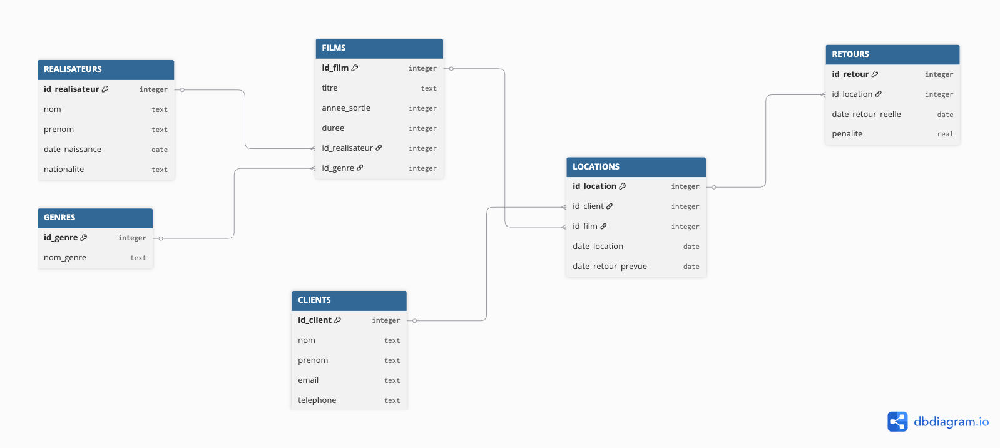

# Système de gestion de vidéothèque (SQL Project)

Ce projet consiste à concevoir une base de données relationnelle pour la gestion d'une vidéothèque, incluant **les réalisateurs**, **les films**, **les clients**, **les genres**, **les locations** et **les retours**.Il a été développé dans le cadre d’un exercice pratique SQL.Les données de la base sont fictives et ont été générées par une intelligence artificielle.

## 🗃️ Objectif

L’objectif principal est de :

- Constituer et maintenir un catalogue de films (titre, année de sortie, durée, genre, réalisateur).
- Gérer les informations des clients (nom, prénom, email, téléphone).
- Enregistrer les opérations de location de DVD et détailler chaque transaction (film loué, date de location, date de retour prévue).
- Suivre les retours de DVD (date de retour réelle) et gérer les pénalités en cas de retard.

Le projet « Système de gestion de location de DVD » répond à différents besoins au sein d’une vidéothèque tels que : traiter les locations (enregistrement des transactions, suivi des dates de location et de retour), gérer le catalogue de films (organisation par genre et réalisateur), suivre les clients (historique des locations) et contrôler les retours avec application éventuelle de pénalités en cas de retard.

## 📁 Structure du projet

- dvd_video.db : base de données principale (SQLite)

- schema.sql → création des tables (schema de base)

- données.sql → Peuplement de la base   

- design.md → Document de conception

- queries.sql → Requêtes de manipulation

- analysis.sql → Requêtes d'analyse
  
- ER_diagram.png → Un diagramme entité-relation (ER)

- README.md : fichier d'explication du projet, de son but et de son exécution

## Modèle Conceptuel : Entités et Relations



## Choix de conception

- Normalisation des données : chaque entité est stockée dans une table distincte (CLIENTS, FILMS, RÉALISATEURS, GENRES) afin d’éviter la redondance et garantir la cohérence des informations.
  
- Table de jonction (LOCATIONS) : la table LOCATIONS permet de modéliser la relation plusieurs-à-plusieurs entre clients et films, tout en enregistrant les informations de chaque transaction (dates).
  
- Clés primaires et étrangères : chaque table possède une clé primaire unique, et les relations sont assurées par des clés étrangères (ex. id_realisateur, id_client), garantissant l’intégrité référentielle.
  
- Choix des types de données : les types (INTEGER, TEXT, REAL, DATE) sont adaptés à la nature des données pour assurer stockage efficace et précision (notamment pour les pénalités et les dates).
  
- Gestion des retours : la table RETOURS, séparée de LOCATIONS, permet de distinguer la transaction de location de son suivi (retour effectif, pénalité).

## Exercice SQL : Gestion de vidéothèque

# Contexte : 
Vous êtes gestionnaire d’un système d’information pour la location de films sur DVD.

Votre mission : gérer efficacement le catalogue de films, le suivi des clients et des locations, et fournir des informations fiables sur l’historique des locations, les retours et les éventuelles pénalités.

Le système doit permettre à la direction de la vidéothèque de :
  - Suivre les films disponibles et leurs caractéristiques (titre, année, genre, réalisateur).
  - Gérer les clients et leurs historiques de location.
  - Contrôler les retours de DVD et appliquer les pénalités pour retard si nécessaire.
  - Produire des rapports simples pour analyser l’activité (films les plus loués, clients réguliers, retards fréquents).

# Tâche à résoudre : 

1. Trouvez des films qui commencent par le mot « the »
   
```
SELECT titre
FROM FILMS
WHERE titre LIKE 'The%' ;
```

2. Le film le plus long

```
SELECT titre, duree
FROM FILMS
WHERE duree = (
	SELECT MAX(duree) 
	FROM FILMS);
```

3. Trouver une liste de films correspondant au producteur et au genre .

```
SELECT FILMS.titre, REALISATEURS.nom AS director_lastname, GENRES.nom_genre
FROM FILMS 
LEFT JOIN REALISATEURS 
	ON FILMS.id_realisateur = REALISATEURS.id_realisateur
JOIN GENRES 
	ON FILMS.id_genre = GENRES.id_genre;
```

4.Nombre de films par genre

```
SELECT g.nom_genre, COUNT(*) AS total_films
FROM FILMS f
JOIN GENRES g 
    ON f.id_genre = g.id_genre
GROUP BY g.nom_genre
ORDER BY total_films DESC;
```

5.Réalisateur a plus de 1 film

```
SELECT r.nom, COUNT(f.id_film) AS nb_films
FROM REALISATEURS r
JOIN FILMS f 
	ON r.id_realisateur = f.id_realisateur
GROUP BY r.nom
HAVING COUNT(f.id_film) > 1;
```

6. Historique des locations de clients
   
```
SELECT c.nom, c.prenom, f.titre, l.date_location
FROM CLIENTS c
JOIN LOCATIONS l 
	ON c.id_client = l.id_client
JOIN FILMS f 
	ON l.id_film = f.id_film
ORDER BY l.date_location DESC;
```

7.Amende totale par client

```
SELECT c.nom, SUM(r.penalite) AS total_penalty
FROM CLIENTS c
JOIN LOCATIONS l 
	ON c.id_client = l.id_client
JOIN RETOURS r 
	ON l.id_location = r.id_location
GROUP BY c.nom
ORDER BY total_penalty DESC;

```


## Limitations 

- Base de données fictive, avec un volume limité de données (pas testé en situation réelle).
  
- Un seul réalisateur et genre par film : le modèle impose une relation 1-N, ce qui limite la possibilité de gérer les co-réalisations ou multi-genres.
  
- Pas de **"Soft Delete"** : la suppression d’un client ou d’un film peut créer des problèmes d’intégrité.


## Perspectives d'amélioration 

- Créer une table de jonction **`FILM_REALISATEURS`** pour gérer plusieurs réalisateurs par film.

- Créer une table de jonction **`FILM_GENRES`** pour attribuer plusieurs genres par film.


## Auteurs

- Thi Hong Nhung Nguyen 


